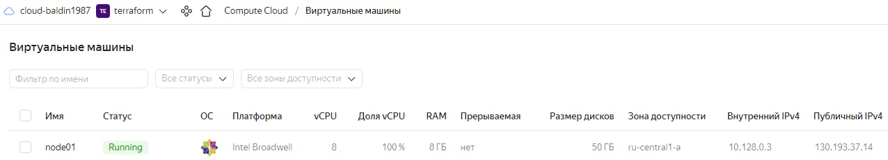
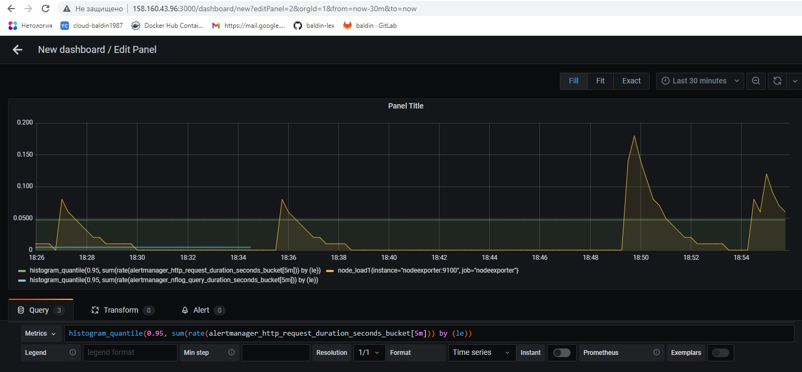

# Домашнее задание к занятию 4. «Оркестрация группой Docker-контейнеров на примере Docker Compose» - Балдин Алексей

### Задача 1

Создайте собственный образ любой операционной системы (например ubuntu-20.04) с помощью Packer ([инструкция](https://cloud.yandex.ru/docs/tutorials/infrastructure-management/packer-quickstart)).

Чтобы получить зачёт, вам нужно предоставить скриншот страницы с созданным образом из личного кабинета YandexCloud.

### Решение:

```console
root@debian:~/terraform# yc compute image list
+----------------------+--------------------------------------+-------------------+----------------------+--------+
|          ID          |                 NAME                 |      FAMILY       |     PRODUCT IDS      | STATUS |
+----------------------+--------------------------------------+-------------------+----------------------+--------+
| fd8rrs2f4rettr4qgmrl | debian-11-nginx-2023-04-01t13-23-12z | debian-web-server | f2ev4ka42u0pf6k8hsp3 | READY  |
+----------------------+--------------------------------------+-------------------+----------------------+--------+
```


---

### Задача 2

**2.1.** Создайте вашу первую виртуальную машину в YandexCloud с помощью web-интерфейса YandexCloud.        

**2.2.*** **(Необязательное задание)**      
Создайте вашу первую виртуальную машину в YandexCloud с помощью Terraform (вместо использования веб-интерфейса YandexCloud).
Используйте Terraform-код в директории ([src/terraform](https://github.com/netology-group/virt-homeworks/tree/virt-11/05-virt-04-docker-compose/src/terraform)).

Чтобы получить зачёт, вам нужно предоставить вывод команды terraform apply и страницы свойств, созданной ВМ из личного кабинета YandexCloud.

### Решение:

***Прилагаю:*** 

***1. Скриншот свойств ВМ, созданной вручную:***


***2. Вывод ```terraform apply```:***

```console
root@debian:~/terraform# terraform apply

Terraform used the selected providers to generate the following execution plan. Resource actions are
indicated with the following symbols:
  + create

Terraform will perform the following actions:

  # yandex_compute_instance.node01 will be created
  + resource "yandex_compute_instance" "node01" {
      + allow_stopping_for_update = true
      + created_at                = (known after apply)
      + description               = "node01"
      + folder_id                 = "b1gniajb0ktdbe17rq35"
      + fqdn                      = (known after apply)
      + gpu_cluster_id            = (known after apply)
      + hostname                  = "node01"
      + id                        = (known after apply)
      + name                      = "node01"
      + network_acceleration_type = "standard"
      + platform_id               = "standard-v2"
      + service_account_id        = (known after apply)
      + status                    = (known after apply)
      + zone                      = "ru-central1-a"

      + boot_disk {
          + auto_delete = true
          + device_name = (known after apply)
          + disk_id     = (known after apply)
          + mode        = (known after apply)

          + initialize_params {
              + block_size  = (known after apply)
              + description = (known after apply)
              + image_id    = "fd8rrs2f4rettr4qgmrl"
              + name        = (known after apply)
              + size        = 30
              + snapshot_id = (known after apply)
              + type        = "network-ssd"
            }
        }

      + network_interface {
          + index              = (known after apply)
          + ip_address         = (known after apply)
          + ipv4               = true
          + ipv6               = (known after apply)
          + ipv6_address       = (known after apply)
          + mac_address        = (known after apply)
          + nat                = true
          + nat_ip_address     = (known after apply)
          + nat_ip_version     = (known after apply)
          + security_group_ids = (known after apply)
          + subnet_id          = "e9b8tnu5mqpdski71t1l"
        }

      + resources {
          + core_fraction = 100
          + cores         = 2
          + memory        = 4
        }
    }

Plan: 1 to add, 0 to change, 0 to destroy.

Do you want to perform these actions?
  Terraform will perform the actions described above.
  Only 'yes' will be accepted to approve.

  Enter a value: yes

yandex_compute_instance.node01: Creating...
yandex_compute_instance.node01: Still creating... [10s elapsed]
yandex_compute_instance.node01: Still creating... [20s elapsed]
yandex_compute_instance.node01: Still creating... [30s elapsed]
yandex_compute_instance.node01: Still creating... [40s elapsed]
yandex_compute_instance.node01: Creation complete after 46s [id=fhmcubn1gasp0ideb502]

Apply complete! Resources: 1 added, 0 changed, 0 destroyed.
```
***3. Скриншот свойств ВМ, созданной terraform:***


---

### Задача 3

С помощью Ansible и Docker Compose разверните на виртуальной машине из предыдущего задания систему мониторинга на основе Prometheus/Grafana.
Используйте Ansible-код в директории ([src/ansible](https://github.com/netology-group/virt-homeworks/tree/virt-11/05-virt-04-docker-compose/src/ansible)).

Чтобы получить зачёт, вам нужно предоставить вывод команды "docker ps" , все контейнеры, описанные в [docker-compose](https://github.com/netology-group/virt-homeworks/blob/virt-11/05-virt-04-docker-compose/src/ansible/stack/docker-compose.yaml),  должны быть в статусе "Up".

### Решение:

***Прилагаю:***

***1. Скрин из ЛК с запущенной ВМ:***



***2. Вывод ```docker ps```:***

```console
[root@localhost ansible]# ssh centos@130.193.37.14
[centos@node01 ~]$ docker ps
permission denied while trying to connect to the Docker daemon socket at unix:///var/run/docker.sock: Get "http://%2Fvar%2Frun%2Fdocker.sock/v1.24/containers/json": dial unix /var/run/docker.sock: connect: permission denied
[centos@node01 ~]$ sudo -i
[root@node01 ~]# docker ps
CONTAINER ID   IMAGE                              COMMAND                  CREATED          STATUS                    PORTS                                                                              NAMES
ae18c9a9ac33   stefanprodan/caddy                 "/sbin/tini -- caddy…"   58 seconds ago   Up 35 seconds             0.0.0.0:3000->3000/tcp, 0.0.0.0:9090-9091->9090-9091/tcp, 0.0.0.0:9093->9093/tcp   caddy
6989de9c4142   gcr.io/cadvisor/cadvisor:v0.47.0   "/usr/bin/cadvisor -…"   58 seconds ago   Up 35 seconds (healthy)   8080/tcp                                                                           cadvisor
1ebdee55bb91   prom/node-exporter:v0.18.1         "/bin/node_exporter …"   58 seconds ago   Up 35 seconds             9100/tcp                                                                           nodeexporter
31942b0856f0   grafana/grafana:7.4.2              "/run.sh"                58 seconds ago   Up 35 seconds             3000/tcp                                                                           grafana
6e07490014c6   prom/prometheus:v2.17.1            "/bin/prometheus --c…"   58 seconds ago   Up 35 seconds             9090/tcp                                                                           prometheus
0186d2d8066f   prom/pushgateway:v1.2.0            "/bin/pushgateway"       58 seconds ago   Up 35 seconds             9091/tcp                                                                           pushgateway
99446128bbc9   prom/alertmanager:v0.20.0          "/bin/alertmanager -…"   58 seconds ago   Up 35 seconds             9093/tcp                                                                           alertmanager
```

---

### Задача 4

1. Откройте веб-браузер, зайдите на страницу http://<внешний_ip_адрес_вашей_ВМ>:3000.
2. Используйте для авторизации логин и пароль из [.env-file](https://github.com/netology-group/virt-homeworks/blob/virt-11/05-virt-04-docker-compose/src/ansible/stack/.env).
3. Изучите доступный интерфейс, найдите в интерфейсе автоматически созданные docker-compose-панели с графиками([dashboards](https://grafana.com/docs/grafana/latest/dashboards/use-dashboards/)).
4. Подождите 5-10 минут, чтобы система мониторинга успела накопить данные.

Чтобы получить зачёт, предоставьте: 

- скриншот работающего веб-интерфейса Grafana с текущими метриками.

### Решение:


